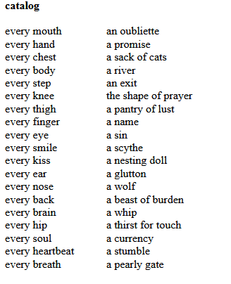

# catalog_poem
This is a matching game inspired by a poem by Todd Dillard

The original poem was posted on twitter: https://twitter.com/toddedillard/status/1653066424062025728

Sources: 

- Fisher-Yates shuffling algortihm: https://www.geeksforgeeks.org/shuffle-a-given-array-using-fisher-yates-shuffle-algorithm/
- Amazing tutorial by James Schneider on Drag & Drop API: https://www.youtube.com/watch?v=twq9WHgUhQc 

